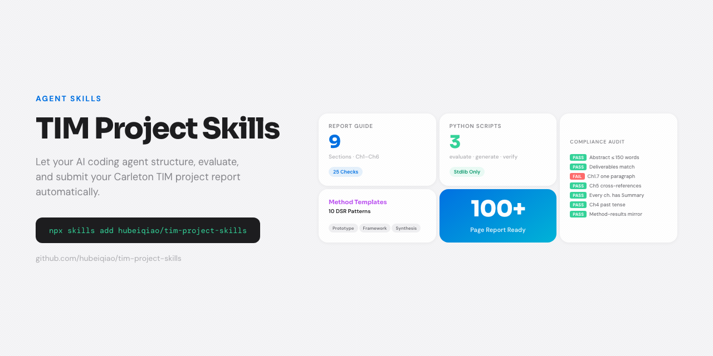

# TIM Project Skills

Installable AI agent skills for Technology Innovation Management (TIM) project work at Carleton University. Let your AI coding agent structure, evaluate, and submit your TIM project report automatically.



## What These Skills Help With

- **Structure a TIM project report** — 9-section guide covering Ch1–Ch6, formatting rules, critical alignment checks, and 10 method templates.
- **Evaluate your report** — 25-item PASS/FAIL compliance checklist that catches common mistakes before submission.
- **Automate checks** — 3 Python scripts to evaluate markdown drafts, generate report skeletons, and verify .docx files.
- **Prepare for submission** — final submission checklist for formatting, pagination, and references.
- **Review a Gate 1 slide deck** — slide structure, required content, and the six official G1 guidelines.
- **Fix a `python-docx` bug** — resolve the style-name vs style-ID mismatch when building .docx files programmatically.

## Install

```bash
npx skills add https://github.com/hubeiqiao/tim-project-skills
```

The installer will guide you through the rest — it finds the available skills, asks which agent(s) you want to install them into, and shows a summary before proceeding.

Works with Claude Code, Codex, Cursor, Cline, and other agents supported by the `skills` installer. You need [Node.js](https://nodejs.org/) installed so `npx` works.

### Install one skill only

```bash
npx skills add https://github.com/hubeiqiao/tim-project-skills --skill tim-project-guide
```

Replace `tim-project-guide` with any skill name from the catalog below.

## Use a Skill

After installation, ask your AI agent to use the skill by name:

- `Use $tim-project-guide to evaluate my completed TIM report.`
- `Use $tim-project-guide to run a compliance audit on my report before submission.`
- `Use $tim-project-guide to help me write the Introduction chapter.`
- `Use $g1-slide-deck-guide to review my Gate 1 presentation outline.`
- `Use $python-docx-style-id-mismatch to fix why my Heading 2 paragraphs keep turning into Normal text.`

## Skill Catalog

| Skill | What it helps with | Example prompt |
| --- | --- | --- |
| `tim-project-guide` | Report structure (9 sections), formatting rules, chapter expectations, 25-item evaluation checklist, submission checklist, document management workflow, and reusable scripts | `Use $tim-project-guide to evaluate my completed TIM report.` |
| `g1-slide-deck-guide` | Gate 1 slide deck structure, required content, and review guidance | `Use $g1-slide-deck-guide to check whether my slides match the G1 format.` |
| `python-docx-style-id-mismatch` | Fix the `python-docx` style-name vs style-ID bug | `Use $python-docx-style-id-mismatch to fix my custom heading insertion script.` |

### What's in `tim-project-guide`

| Section | Content |
| --- | --- |
| 1. Formatting Rules | Margins, font, spacing, pagination, title page, abstract, ToC guidance |
| 2. Report Structure | Getting started checklist, Ch1–Ch6 with section-by-section guidance, common mistake callouts |
| 3. Critical Alignment Rules | Deliverable consistency, activity/outcome separation, provenance labels |
| 4. Research Method Templates | 10 DSR method patterns with step-by-step tables |
| 5. Common Supervisor Feedback | Anticipate and address typical revision requests |
| 6. Quick Reference Checklist | 25-item checklist for structure, content, citations, and appendices |
| 7. Report Evaluation Workflow | PASS/FAIL audit process, items most likely to fail, automation guide |
| 8. Final Submission Checklist | Formatting, pagination, auto-generated lists, title page, references |
| 9. Document Management Workflow | Markdown-to-docx sync, supervisor feedback handling, decision table |

### Scripts

Three Python scripts in `skills/tim-project-guide/scripts/`:

| Script | What it does | Requirements |
| --- | --- | --- |
| `evaluate_report.py` | Auto-checks ~17 checklist items on markdown chapter files. PASS/FAIL output with evidence. | Python 3.8+ (stdlib only) |
| `generate_shell.py` | Creates markdown skeleton files with all required section headings. Configurable: `--approach A\|B`, `--steps N`, `--deliverables N`. | Python 3.8+ (stdlib only) |
| `verify_docx.py` | Converts .docx to markdown via pandoc, runs evaluation checks, and compares against markdown drafts for sync issues. | Python 3.8+ and pandoc |

```bash
# Evaluate markdown drafts
python scripts/evaluate_report.py path/to/TIM_Report_Draft/

# Generate a report shell with 6 method steps and 4 deliverables
python scripts/generate_shell.py --steps 6 --deliverables 4 output/

# Verify a .docx against markdown drafts
python scripts/verify_docx.py report.docx --drafts path/to/TIM_Report_Draft/
```

## Document Skills

The `docx`, `pdf`, and `pptx` skills come from Anthropic's public skills repository, not this repo. Install them separately:

```bash
npx skills add https://github.com/anthropics/skills
```

Then choose `docx`, `pdf`, and `pptx` during the installer flow.

## Troubleshooting

| Problem | Solution |
| --- | --- |
| `npx: command not found` | Install [Node.js](https://nodejs.org/) and open a new terminal window |
| Skill does not appear in agent | Restart the agent app or terminal, then re-run the install command |
| Installed wrong skill or agent | Run the installer again and choose the correct target |
| Want to preview available skills | Run `npx skills add https://github.com/hubeiqiao/tim-project-skills --list` |

## Provenance

The TIM-specific skills in this repository are adapted from TIM project guideline materials for the TIM report and Gate 1 slide deck. Practical guidance (labeled inline) is derived from experience completing a full TIM project report.

## License

Unless a file or subdirectory says otherwise, original repository-authored material is available under the root [MIT License](LICENSE).
